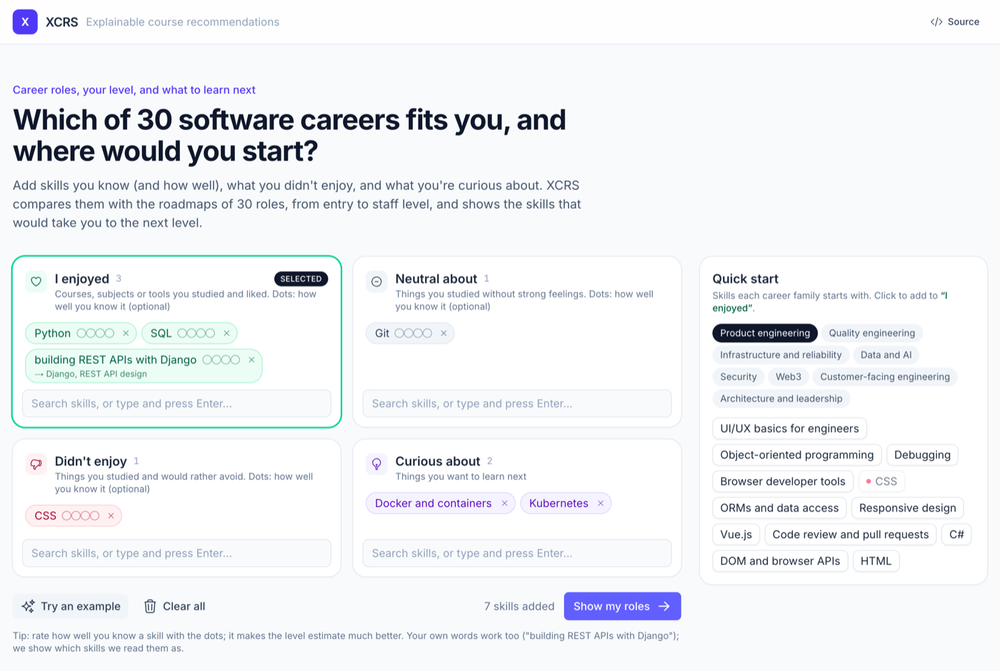
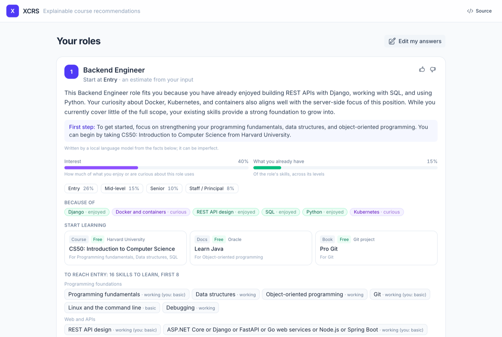

# XCRS — Explainable Course Recommendation System

XCRS recommends **career roles** and **online courses** based on what you have already learned and what you are curious about, and explains **why** it recommends each one, in plain language built from your own input.

> **Status:** the `modernization` branch is a work in progress toward a production-ready, self-hosted XCRS. The original research prototype lives on the `main` branch and in the [Zenodo release](#research-origin--citation).

| Tell it what you know | See roles, courses and why |
|---|---|
|  |  |

## How it works

You sort skills, subjects and courses into four boxes (drag, click a suggestion, or type):

| Box | Meaning | Weight |
|---|---|---|
| Curious about | Things you want to learn | `1.0` |
| I enjoyed | Things you studied and liked | `0.75` |
| Neutral about | Things you studied, no strong feelings | `0.5` |
| Didn't enjoy | Things you studied and would rather avoid | `-0.25` |

XCRS then:

1. **Embeds** each item with a self-hosted embedding model (`qwen3-embedding:0.6b`).
2. **Matches** it to concepts from 10 [roadmap.sh](https://roadmap.sh) career roadmaps: every concept above a statistical threshold (mean + 2.5σ), with a fallback so short, generic items such as "Python" aren't dropped.
3. **Scores the 10 career roles** by weighted concept coverage, squashed through a sigmoid, and keeps the top 3.
4. **Recommends up to 3 Udemy courses per role**, aimed at the roadmap concepts you haven't covered yet, from precomputed concept → course matches, down-weighting courses similar to what you didn't enjoy.
5. **Explains** each role and course with a local LLM, given only the facts the algorithm used. The recommendation returns in under a second; explanations arrive in the background.

Roles: AI Data Scientist · Android Developer · Backend Developer · Blockchain Developer · DevOps Engineer · Frontend Developer · Full Stack Developer · Game Developer · QA Engineer · UX Designer

## Architecture

```
Browser ──► Nuxt 4 (skill board, linked results; proxies /api/v1/**)
                 │
                 ▼
         FastAPI /api/v1  ──  api/ → services/ → pure domain/ + adapters
           ├─ embeddings ──► Ollama  qwen3-embedding:0.6b
           ├─ explanations (background worker, LangChain) ──► Ollama  qwen3.5:9b (GPU) / 4b (CPU)
           └─ repository ──► PostgreSQL + pgvector (catalog, per-model vectors, activity, job queue)
```

| Folder | Stack | Purpose |
|---|---|---|
| [`backend/`](backend) | Python 3.13, FastAPI, SQLAlchemy, Alembic, LangChain, uv | API, recommendation algorithm, explanation worker, admin CLI (`xcrs`), evaluation tools (`eval/`) |
| [`frontend/`](frontend) | Nuxt 4, Nuxt UI 4, Tailwind 4 | Skill board and results pages |
| [`data/research-2024/`](data/research-2024) | CSV, JSON | Seed catalog: 453 courses, 10 roadmaps (1,104 nodes) |
| [`docs/`](docs) | Markdown | [Decision records](docs/adr/README.md), [architecture](docs/architecture.md), [schema](docs/schema.md), [measurements](docs/baseline.md) |

## Run it locally

```bash
brew install ollama uv
ollama serve &                                # Ollama runs natively (uses the Apple GPU)
ollama pull qwen3-embedding:0.6b
ollama pull qwen3.5:9b                        # explanations; on a CPU-only machine: qwen3.5:4b (ADR-0020)
cp .env.example .env
docker compose up -d postgres

cd backend
uv sync
uv run alembic upgrade head                   # create the schema
uv run xcrs import-research-data              # seed catalog → Postgres
uv run xcrs register-model qwen3-embedding:0.6b --id 1 --status active
uv run xcrs embed-catalog qwen3-embedding:0.6b
uv run pytest

uv run uvicorn xcrs.api.app:app --port 8000   # API docs: http://localhost:8000/docs
cd ../frontend && pnpm install && pnpm run dev # UI:       http://localhost:3000
```

Everything in containers (as on the servers), with Ollama still native:

```bash
docker compose --profile app up -d --build    # postgres + api (:8000) + web (:3000)
docker compose run --rm api alembic upgrade head
```

**Backups** of PostgreSQL (the activity data can't be rebuilt; the catalog can):

```bash
scripts/db-backup.sh                     # compressed dump + manifest (row counts, checksum) in backups/, keeps 14
scripts/db-verify-backup.sh              # restores the newest dump into a throwaway container and compares
scripts/db-restore.sh DUMP xcrs_copy     # restore into a new database (--replace to overwrite the live one)
```

Backups stay on the machine that made them; copy them elsewhere too.

**CI** (GitHub Actions) runs Ruff, the migrations (up, down, up), the tests, the frontend type check and build, and both image builds on every push. **Evaluation** (`backend/eval/`): `bench_explainer.py` measures explanation speed and grounding per model and device; `compare_prototype.py` gives threshold diagnostics and, with the research prototype running from `main`, a prototype-vs-new comparison.

## Research origin & citation

XCRS started as an academic research project: five embedding providers compared side by side, `gpt-4o` explanations, and a user study. That prototype is on the `main` branch, and the replication package (code, data, the user-study protocol, questions and responses) is archived on Zenodo:

[](https://doi.org/10.5281/zenodo.14291086)

## Credits

- Courses: [Udemy](https://udemy.com)
- Roadmaps: [roadmap.sh](https://roadmap.sh) ([GitHub](https://github.com/kamranahmedse/developer-roadmap))

## License

[GPL-3.0-or-later](LICENSE.md)
