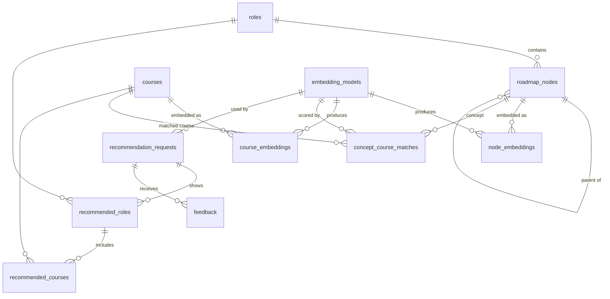

# Database schema

The PostgreSQL + pgvector schema, consolidated from ADRs [0003](adr/0003-postgresql-pgvector-primary-store.md) and [0008](adr/0008-embedding-tables-per-entity.md)–[0013](adr/0013-user-activity-hybrid-then-normalized.md). This is the blueprint for the initial Alembic migration. When a decision changes, the ADR changes first and this document follows.

## Overview



Three groups of tables:
- **Catalog:** `roles`, `roadmap_nodes`, `courses`. What we recommend from.
- **Vectors:** `embedding_models`, `node_embeddings`, `course_embeddings`, `concept_course_matches`. Model-specific data; several models can coexist.
- **Activity:** `recommendation_requests`, `recommended_roles`, `recommended_courses`, `feedback`. What users asked for, what they were shown, and what they thought of it.

## Conventions

- **Extension:** `CREATE EXTENSION vector`. UUIDs come from the built-in `gen_random_uuid()`.
- **Timestamps** are `timestamptz`, default `now()`.
- **Status-like columns** are `text` with a `CHECK` constraint rather than Postgres `ENUM` types. That makes them easier to extend in a migration.
- **Surrogate keys** are `bigint GENERATED ALWAYS AS IDENTITY`; small lookup tables use `smallint`. Natural keys are kept as `UNIQUE` constraints.
- **Deleting** a catalog entity cascades to its embeddings and matches. Activity rows reference the catalog **without** cascade, so history isn't silently deleted.

## Catalog

### `roles`
| Column | Type | Notes |
|---|---|---|
| `id` | smallint PK | The prototype's ids 1–10 are kept for comparison |
| `slug` | text UNIQUE NOT NULL | `backend`, `ai-data-scientist`, … (roadmap.sh file name) |
| `name` | text NOT NULL | "Backend Developer" |
| `created_at` | timestamptz | |

Replaces the role list hardcoded in 3 places.

### `roadmap_nodes`
| Column | Type | Notes |
|---|---|---|
| `id` | bigint PK | |
| `role_id` | smallint NOT NULL → `roles` | |
| `parent_id` | bigint NULL → `roadmap_nodes` | NULL = top-level topic of the role |
| `type` | text NOT NULL, CHECK in (`topic`, `concept`) | |
| `name` | text NOT NULL | |
| `content` | text NOT NULL | Markdown content; this is what gets embedded for concepts |
| `position` | int NOT NULL | Order among siblings |
| `sequence` | int NOT NULL | Global depth-first order within the role (see open point 2) |
| `legacy_id` | bigint UNIQUE NULL | The prototype's digit-encoded id (e.g. `60203`), for comparing prototype vs new |
| `source` | text NOT NULL | `roadmap.sh`; later also generated roadmaps (ADR-0004) |
| `source_version` | text NULL | Roadmap version or commit it came from |
| `content_hash` | text NOT NULL | Detects changed content, so only changed nodes are re-embedded |
| `created_at`, `updated_at` | timestamptz | |

Index: `(role_id, sequence)`, `(parent_id)`.
Enforced in code, not by constraints: a child has the same `role_id` as its parent; only `concept` nodes get embeddings and matches.

### `courses`
| Column | Type | Notes |
|---|---|---|
| `id` | bigint PK | |
| `source` | text NOT NULL | `udemy`; other platforms later |
| `source_id` | text NOT NULL | The platform's own id (Udemy `366280`) |
| `title`, `url`, `headline` | text | |
| `description`, `what_you_learn` | text | |
| `category` | text | "Development,Programming Languages,Java" |
| `language` | text | |
| `is_paid` | boolean | |
| `price` | numeric NULL | The prototype stored strings like "Free" |
| `rating` | real NULL | |
| `embed_text` | text NOT NULL | The exact text that gets embedded (prototype: `concat_text`) |
| `content_hash` | text NOT NULL | Hash of `embed_text` |
| `is_active` | boolean NOT NULL DEFAULT true | Replaces the hardcoded exclusion of course `2602800` (see open point 1) |
| `fetched_at`, `created_at`, `updated_at` | timestamptz | |

Constraint: `UNIQUE (source, source_id)`.

## Vectors

### `embedding_models` (registry)
| Column | Type | Notes |
|---|---|---|
| `id` | smallint PK | |
| `name` | text UNIQUE NOT NULL | Exact model tag, e.g. `qwen3-embedding:0.6b` |
| `runtime` | text NOT NULL | `ollama` |
| `quantization` | text NOT NULL | Pinned, so vectors are reproducible across machines (ADR-0007) |
| `dimensions` | int NOT NULL CHECK > 0 | Defines this model's vector size and its index cast |
| `query_prefix` | text NULL | Instruction or prefix for queries (models differ; ADR-0006) |
| `document_prefix` | text NULL | Prefix for documents |
| `status` | text NOT NULL, CHECK in (`candidate`, `active`, `retired`) | |
| `sim_mean`, `sim_std` | real NULL | Threshold statistics (ADR-0009) |
| `stats_computed_at` | timestamptz NULL | |
| `created_at` | timestamptz | |

Constraint: **at most one active model**, via `CREATE UNIQUE INDEX ... ON embedding_models ((true)) WHERE status = 'active'`.

### `course_embeddings`, `node_embeddings`
| Column | Type | Notes |
|---|---|---|
| `course_id` / `node_id` | bigint → `courses` / `roadmap_nodes`, ON DELETE CASCADE | |
| `model_id` | smallint → `embedding_models` | |
| `embedding` | `vector` (**untyped**) NOT NULL | Size is checked against `embedding_models.dimensions` in code |
| `content_hash` | text NOT NULL | Hash of the text at embedding time; a mismatch means the vector is stale |
| `created_at` | timestamptz | |

Primary key: `(course_id, model_id)` / `(node_id, model_id)`.

Indexes (created by one Alembic migration per model; ADR-0009, ADR-0010):
```sql
-- course side: needed by ingestion (nearest courses for a new or changed concept)
CREATE INDEX CONCURRENTLY course_emb_m1_hnsw ON course_embeddings
  USING hnsw ((embedding::vector(1024)) vector_cosine_ops) WHERE model_id = 1;
-- node side: none for now; the request path uses an exact threshold scan
```
Dimensions over 2,000 use `halfvec(n)` / `halfvec_cosine_ops` instead.

### `concept_course_matches`
| Column | Type | Notes |
|---|---|---|
| `model_id` | smallint → `embedding_models` | |
| `concept_id` | bigint → `roadmap_nodes`, ON DELETE CASCADE | |
| `course_id` | bigint → `courses`, ON DELETE CASCADE | |
| `similarity` | real NOT NULL | |
| `rank` | smallint NOT NULL, CHECK between 1 and 20 | 1 = best course for this concept |

Primary key: `(model_id, concept_id, course_id)`. Unique: `(model_id, concept_id, rank)`. Index: `(model_id, course_id)`, used when a course changes and its rows must be recomputed.

## Activity

### `recommendation_requests`
| Column | Type | Notes |
|---|---|---|
| `id` | uuid PK DEFAULT `gen_random_uuid()` | |
| `created_at` | timestamptz | |
| `model_id` | smallint → `embedding_models` | |
| `algorithm_version` | text NOT NULL | |
| `threshold_used` | real NOT NULL | Reproducibility (ADR-0013) |
| `input` | jsonb NOT NULL | **Transitional**; normalized after the input redesign |
| `status` | text NOT NULL, CHECK in (`ok`, `insufficient_input`, `error`) | |
| `latency_ms` | int NULL | |
| `error` | text NULL | |

Index: `(created_at)`.

### `recommended_roles`
`request_id` uuid → `recommendation_requests` ON DELETE CASCADE · `rank` smallint · `role_id` → `roles` · `score` real · `explanation` text · `prompt_version` text NULL (which prompt produced the role's explanations; ADR-0019).
Primary key: `(request_id, rank)`. Unique: `(request_id, role_id)`.

### `recommended_courses`
`request_id` · `role_id` · `rank` smallint · `course_id` → `courses` · `similarity` real · `explanation` text.
Primary key: `(request_id, role_id, rank)`. Foreign key: `(request_id, role_id)` → `recommended_roles (request_id, role_id)` ON DELETE CASCADE.

### `feedback`
`id` bigint PK · `request_id` → `recommendation_requests` ON DELETE CASCADE · `role_id` NULL · `course_id` NULL · `rating` smallint NULL (format decided with the frontend) · `comment` text NULL · `created_at`.
Both target columns NULL means feedback on the request as a whole (what the Google Form collected).

## Size today

| Table | Rows (1 model) |
|---|---|
| roles | 10 |
| roadmap_nodes | 1,104 |
| courses | 453 |
| node_embeddings (concepts only) | 869 |
| course_embeddings | 453 |
| concept_course_matches | ≤ 17,380 (869 × 20) |

Vector storage is ~5 MB at 1,024 dimensions. The whole database is tiny; the design targets growth, not the current size.

## Notes from consolidating (resolved 2026-09-28)

1. **Hardcoded course exclusion.** `recommend_courses` always removes course `2602800` (*SAP Overview*, `backend/src/recom.py`). It was a quick patch: the course was recommended to many students where it wasn't relevant. The root cause is **thin item text producing vague embeddings**, and the real fixes are richer roadmap descriptions and enriched user input. `courses.is_active` remains as a manual switch, not the fix.
2. **Roadmap order encodes learning order.** The prototype ordered concepts by their digit-encoded ids (`util.equalize_digits`) to follow the **arrows of the real roadmaps**: prerequisites and increasing difficulty. `sequence` preserves that order at import. With our own roadmaps, prerequisites may later become explicit graph edges (a DAG rather than a tree); that will be a future ADR.
3. **Topic embeddings.** Not used today, because of how roadmap.sh roadmaps are structured. The schema can embed any node type, so topics can be embedded if a new roadmap structure makes them meaningful.
4. **Query vs document prefixes** are per-model settings stored in the registry. This fixes the prototype's embedding of user queries as documents.
